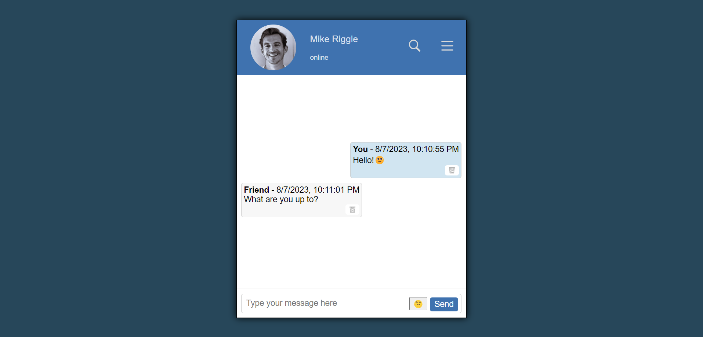

# Chat Window
This is a chat window powered by JavaScript that provides the main functions you'd expect from a chat, such as emojis, private messages, an admin system, etc.

## Features
- Material Design
- Emoji support
- Message deleting
- "Like" support
- Other awesome features yet to be implemented
